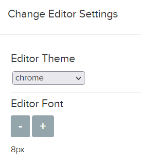
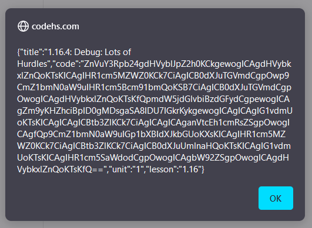

<h1 align="center"> CodeHS Answers for Computer Science Principles in JavaScript </h1>

This repository contains the code examples and answers for the **Computer Science Principles in JavaScript** course on [CodeHS](https://codehs.com). Leave a star 🌟 if you found this helpful!

Quiz answers and open-response answers are NOT included! Please keep in mind copy-pasting code directly from here is not the smartest thing to do. You should try to solve the problems yourself first, and only use this as a reference if you get stuck.

# How does it work?

Two scripts, `automate.js` and `browser.js` are used to automate the process of copying code from CodeHS to this repository. Keep in mind [Node.JS](https://nodejs.org) is required to run these!

`browser.js` is designed to be ran in the browser, and spits out a JSON object for use with `automate.js`. The easiest way to run the script is via a bookmarklet.

Make sure your editor size is set to be incredibly small. This is because code that isn't visible on screen will not be copied.

Run the bookmarklet and copy the JSON object that alerted.

Run `node automate.js`. You'll be greeted with a prompt saying `Enter output from bookmarklet:`. Paste the JSON object you copied earlier and press enter. The files should be created automatically.

# License
This repository is under the [MIT License](https://mit-license.org/). This allows you to use, modify, and distribute the source as long as you include the license.